# ForestSearch Package Architecture

## Function Relationships and Module Organization

**ForestSearch Development Team**

---

## Overview

ForestSearch is a comprehensive R package for exploratory subgroup identification in clinical trials with survival endpoints. The package implements advanced methods from León et al. (2024) published in *Statistics in Medicine*.

**Key Methods:**

- Generalized Random Forests (GRF) for variable importance
- LASSO regularization for dimension reduction
- Exhaustive combinatorial search for subgroup discovery
- Split-sample validation for consistency assessment
- Bootstrap bias correction using infinitesimal jackknife methods

---

## High-Level Workflow

The ForestSearch algorithm proceeds through five main phases:

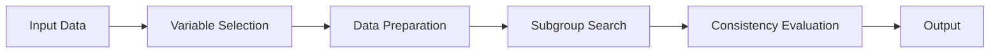

After the core analysis, optional validation steps include:

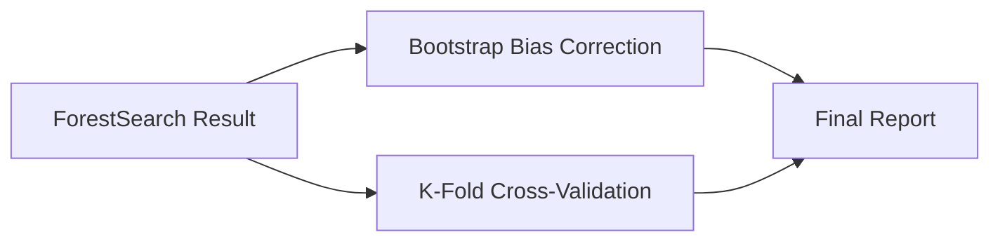

---

## Phase 1: Main Entry Point

### `forestsearch()` - The Orchestrator

**Location:** `R/forest_search_revised.R`

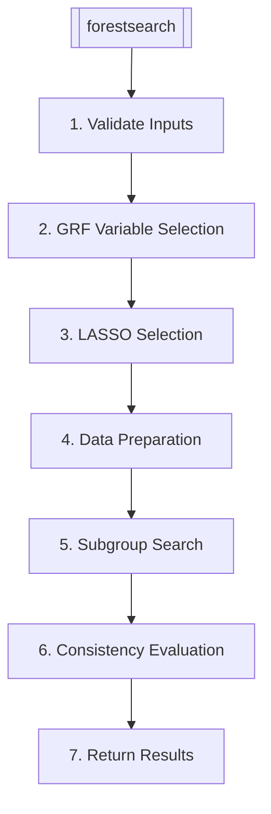

**Key Parameters:**

| Parameter | Description | Default |
|-----------|-------------|---------|
| `df.analysis` | Analysis dataset | Required |
| `confounders.name` | Candidate variables | NULL |
| `use_lasso` | Enable LASSO | TRUE |
| `use_grf` | Enable GRF | TRUE |
| `hr.threshold` | Min HR for candidates | 1.25 |
| `pconsistency.threshold` | Consistency requirement | 0.90 |
| `fs.splits` | Validation splits | 1000 |
| `maxk` | Max factors per subgroup | 2 |

---

## Phase 2: Variable Selection

### GRF-Based Selection

**Function:** `grf.subg.harm.survival()`  
**Location:** `R/grf_main.R`

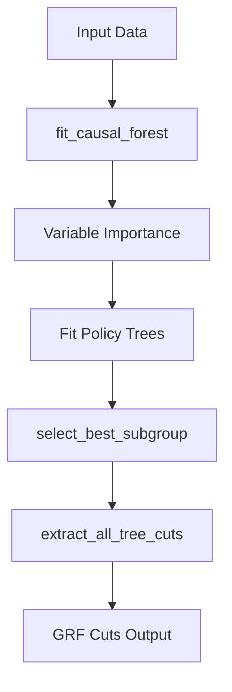

**GRF Helper Functions:**

| Function | Purpose |
|----------|---------|
| `create_grf_config()` | Initialize parameters |
| `fit_causal_forest()` | Fit causal survival forest |
| `compute_node_metrics()` | Metrics per tree node |
| `select_best_subgroup()` | Choose optimal subgroup |
| `extract_all_tree_cuts()` | Get cut expressions |

### LASSO-Based Selection

**Function:** `lasso_selection()`  
**Location:** `R/get_FSdata_helpers.R`

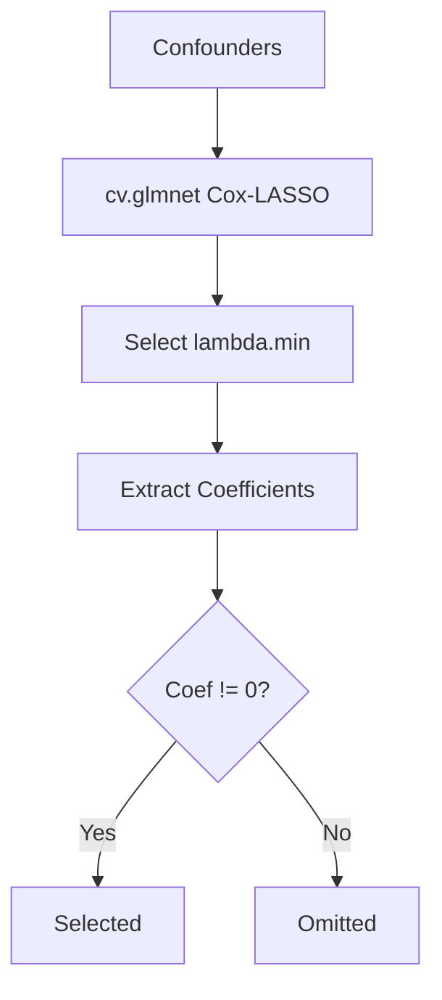

---

## Phase 3: Data Preparation

### `get_FSdata()` - Creating Binary Indicators

**Location:** `R/get_FSdata_refactored.R`

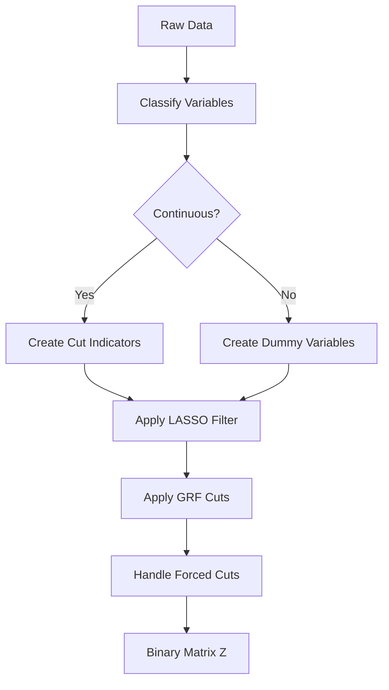

**Data Preparation Helpers:**

| Function | Purpose |
|----------|---------|
| `is.continuous()` | Check variable type |
| `dummy()` | Create dummy variables |
| `get_conf_force()` | Generate forced cuts |
| `evaluate_cuts_once()` | Evaluate & cache cuts |
| `FS_labels()` | Convert q-codes to labels |
| `filter_by_lassokeep()` | Apply LASSO filter |

---

## Phase 4: Subgroup Search

### `subgroup.search()` - Exhaustive Combinatorial Search

**Location:** `R/subgroup_search.R`

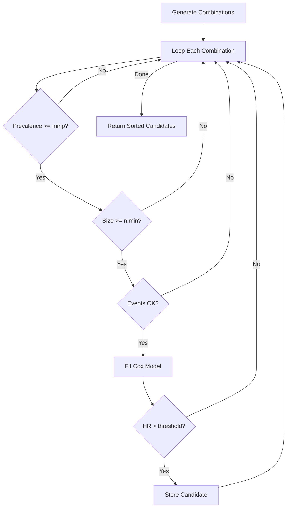

**Search Helper Functions:**

| Function | Purpose |
|----------|---------|
| `prepare_search_data()` | Clean data |
| `generate_combination_indices()` | Create k-combinations |
| `search_combinations()` | Main search loop |
| `evaluate_combination()` | Test one combination |
| `get_covs_in()` | Factor indicators |
| `get_subgroup_membership()` | Membership vector |
| `format_search_results()` | Format as data.table |

---

## Phase 5: Consistency Evaluation

### `subgroup.consistency()` - Split-Sample Validation

**Location:** `R/subgroup_consistency_main.R`

#### Fixed Algorithm (Default)

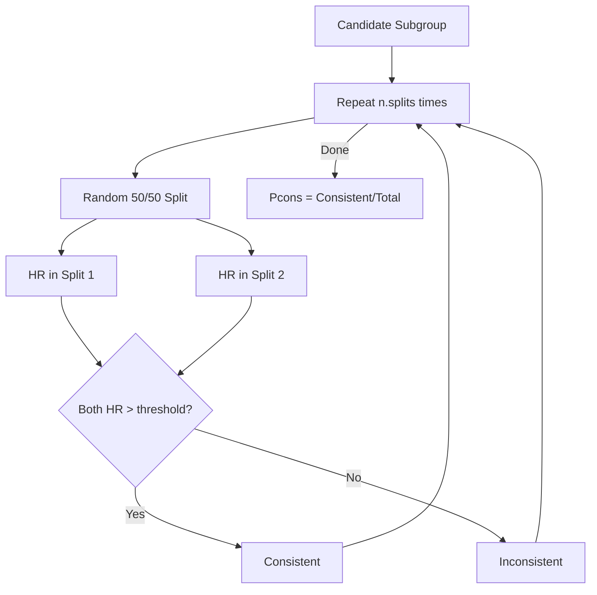

#### Two-Stage Algorithm (Optional)

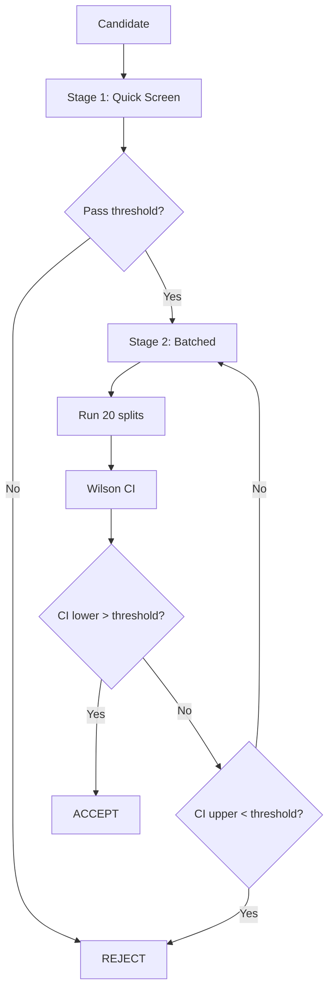

**Consistency Helper Functions:**

| Function | Purpose |
|----------|---------|
| `evaluate_subgroup_consistency()` | Fixed algorithm |
| `evaluate_consistency_twostage()` | Two-stage algorithm |
| `get_split_hr_fast()` | Fast HR for split |
| `wilson_ci()` | Wilson confidence interval |
| `early_stop_decision()` | Early stopping logic |
| `sort_subgroups()` | Sort by sg_focus |
| `extract_subgroup()` | Get subgroup definition |

---

## Phase 6: Bootstrap Bias Correction

### `forestsearch_bootstrap_dofuture()`

**Location:** `R/bootstrap_dofuture_main.R`

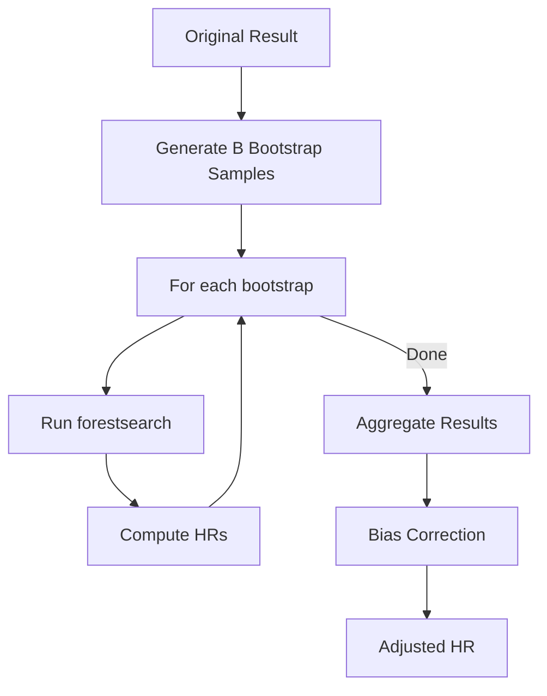

**Bias Correction Formulas:**

| Method | Formula |
|--------|---------|
| Simple Optimism | H_adj1 = H_obs - (H*_* - H*_obs) |
| Double Bootstrap | H_adj2 = 2×H_obs - (H_* + H*_* - H*_obs) |

**Bootstrap Helper Functions:**

| Function | Location |
|----------|----------|
| `bootstrap_results()` | Coordinate iterations |
| `run_single_bootstrap()` | One bootstrap iteration |
| `summarize_bootstrap_results()` | Aggregate statistics |
| `summarize_bootstrap_subgroups()` | Subgroup agreement |

---

## Phase 7: Cross-Validation

### `forestsearch_Kfold()`

**Location:** `R/forestsearch_cross-validation.R`

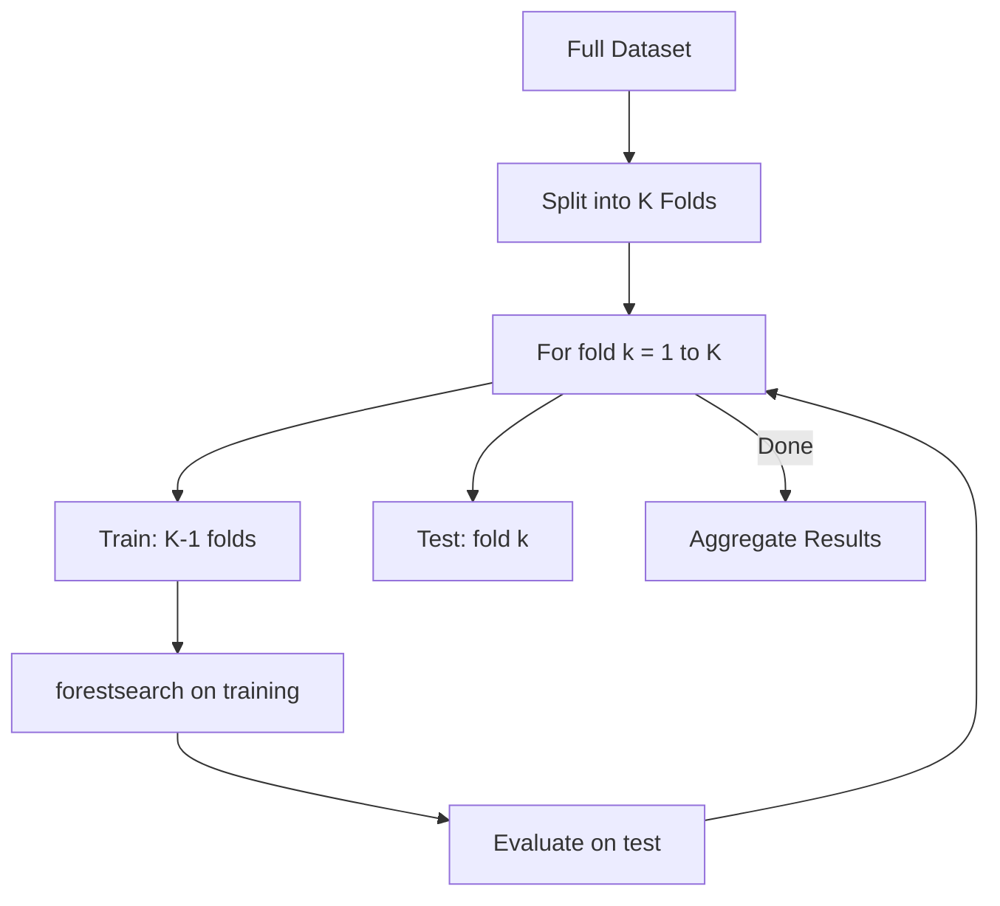

**CV Helper Functions:**

| Function | Purpose |
|----------|---------|
| `forestsearch_KfoldOut()` | Summarize K-fold results |
| `forestsearch_tenfold()` | Repeated K-fold wrapper |
| `find_covariate_any_match()` | Match covariates across folds |

---

## Phase 8: Output & Visualization

### S3 Methods and Summary Functions

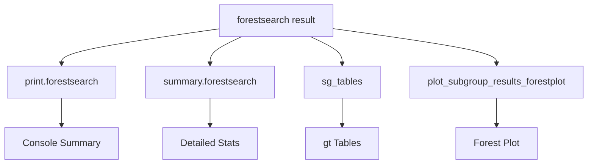

**Output Functions:**

| Function | Purpose |
|----------|---------|
| `print.forestsearch()` | Basic summary |
| `summary.forestsearch()` | Detailed stats |
| `sg_tables()` | gt-formatted tables |
| `plot_subgroup_results_forestplot()` | Forest plots |
| `cox_cs_fit()` | Spline Cox models |
| `filter_call_args()` | Filter function args |

---

## Simulation & DGM Module

### Data Generation for Simulations

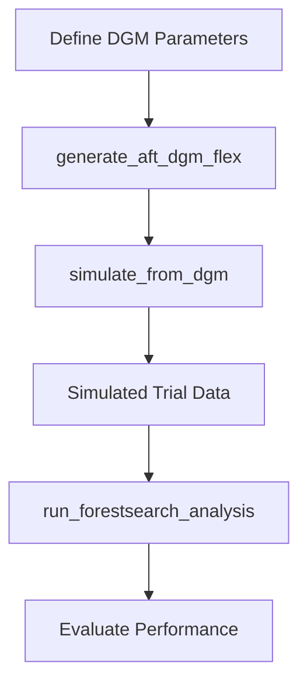

**Simulation Functions:**

| Function | Location | Purpose |
|----------|----------|---------|
| `generate_aft_dgm_flex()` | `generate_aft_dgm_flex.R` | Create AFT DGM |
| `simulate_from_dgm()` | `simulate_from_dgm.R` | Generate data |
| `run_mrct_simulation()` | `mrct_simulation.R` | MRCT simulation |
| `run_single_simulation()` | `oc_analyses_gbsg.R` | Single iteration |

---

## Parallel Processing

ForestSearch supports multiple parallel backends:

| Backend | Description | Platform |
|---------|-------------|----------|
| `sequential` | Single thread | All |
| `multisession` | Background R sessions | All |
| `multicore` | Fork processes | Unix/Mac |
| `callr` | Separate R processes | All |

---

## Package Dependencies

### Core Statistical
- `survival` - Cox models
- `grf` - Generalized Random Forests
- `glmnet` - LASSO regularization
- `policytree` - Policy trees

### Data Handling
- `data.table` - Fast data operations
- `stringr` - String manipulation

### Parallel Computing
- `future` - Parallel framework
- `doFuture` - foreach integration
- `foreach` - Parallel loops
- `callr` - R subprocess execution

### Visualization
- `ggplot2` - Plotting
- `gt` - Table formatting
- `forestploter` - Forest plots

---

## File Organization

```
R/
├── forest_search_revised.R          # Main forestsearch()
├── get_FSdata_refactored.R          # Data preparation
├── get_FSdata_helpers.R             # Data prep helpers
├── subgroup_search.R                # Exhaustive search
├── subgroup_consistency_main.R      # Consistency evaluation
├── subgroup_consistency_helpers.R   # Consistency helpers
├── grf_main.R                       # GRF subgroup ID
├── grf_helpers.R                    # GRF helpers
├── bootstrap_dofuture_main.R        # Bootstrap main
├── bootstrap_analysis_dofuture.R    # Bootstrap iteration
├── bootstrap_summaries_helpers.R    # Bootstrap summary
├── summarize_bootstrap_subgroups.R  # Subgroup summary
├── forestsearch_cross-validation.R  # K-fold CV
├── summary_utility_functions.R      # Output utilities
├── summary_forestsearch.R           # S3 summary
├── plot_subgroup_results_forestplot.R # Forest plots
├── cox_spline_fit.R                 # Spline Cox
├── generate_aft_dgm_flex.R          # DGM generation
├── simulate_from_dgm.R              # Simulation
├── mrct_simulation.R                # MRCT sim
└── oc_analyses_gbsg.R               # OC analyses
```

---

## Typical Workflow Example

```r
# 1. Run main analysis
fs_result <- forestsearch(
  df.analysis = trial_data,
  confounders.name = c("age", "biomarker", "stage"),
  hr.threshold = 1.25,
  pconsistency.threshold = 0.90,
  use_grf = TRUE,
  use_lasso = TRUE,
  details = TRUE
)

# 2. Bootstrap bias correction
fs_boot <- forestsearch_bootstrap_dofuture(
  fs.est = fs_result,
  nb_boots = 1000,
  parallel_args = list(plan = "callr", workers = 6)
)

# 3. Cross-validation
fs_cv <- forestsearch_Kfold(
  fs.est = fs_result,
  Kfolds = 10
)

# 4. Summary and visualization
print(fs_result)
sg_tables(fs_result)
```

---

## References

- León LF, et al. (2024). Exploratory subgroup identification in the heterogeneous Cox model. *Statistics in Medicine*.
- Athey S, Imbens G (2016). Recursive partitioning for heterogeneous causal effects. *PNAS*.
- Wager S, Athey S (2018). Estimation and inference of heterogeneous treatment effects using random forests. *JASA*.

---

*Document generated for ForestSearch R package - CRAN submission preparation*
