# ForestSearch Architecture - DiagrammeR/Graphviz Version
# 
# This file contains Graphviz DOT code that can be rendered using:
# 1. R: DiagrammeR::grViz() function
# 2. Online: https://dreampuf.github.io/GraphvizOnline/
# 3. Command line: dot -Tpng file.dot -o file.png
#
# Each diagram is in a separate code block below.

## How to use in R:

```r
# Install DiagrammeR if needed
# install.packages("DiagrammeR")

library(DiagrammeR)

# Copy the DOT code between the triple backticks and paste into grViz()
grViz("
  digraph {
    ...
  }
")
```

---

## Diagram 1: High-Level Pipeline

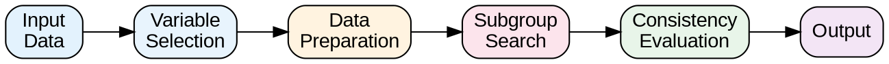

---

## Diagram 2: Main Function Flow

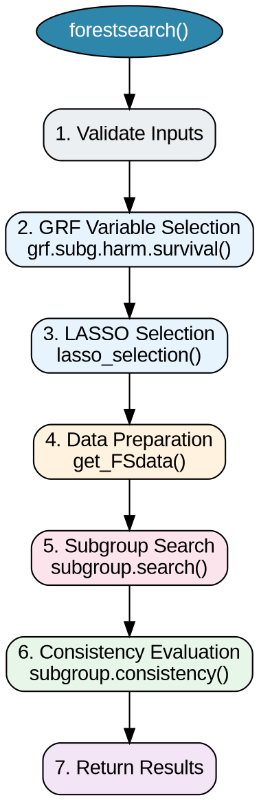

---

## Diagram 3: GRF Variable Selection

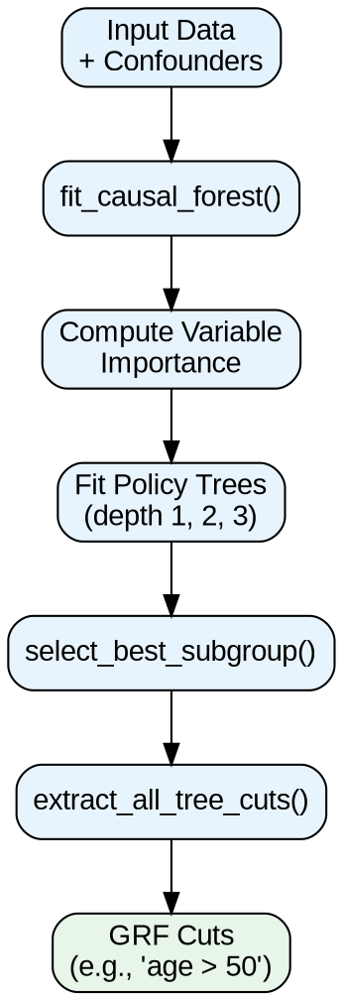

---

## Diagram 4: LASSO Selection

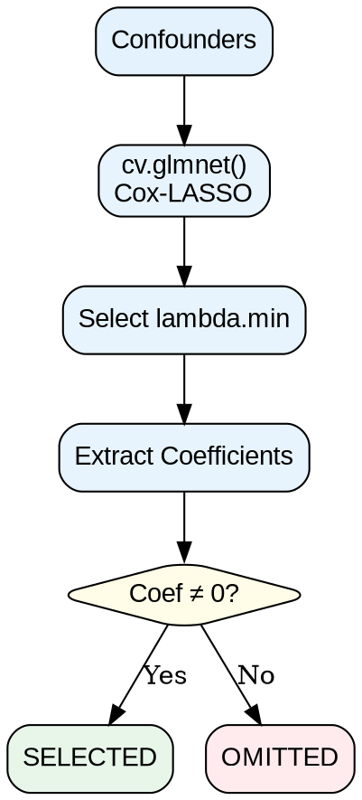

---

## Diagram 5: Data Preparation

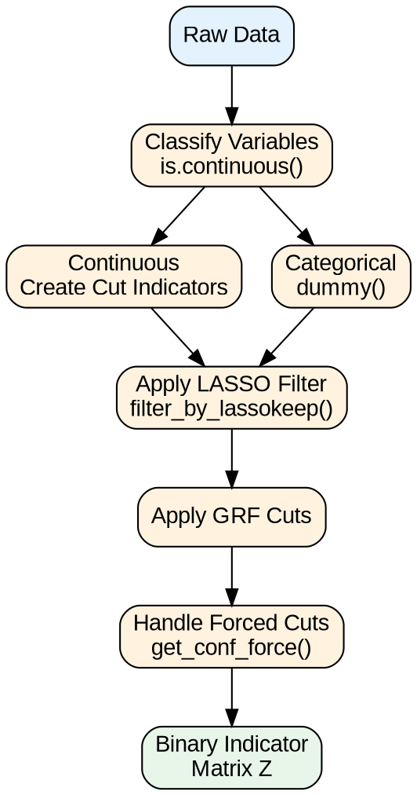

---

## Diagram 6: Subgroup Search Algorithm

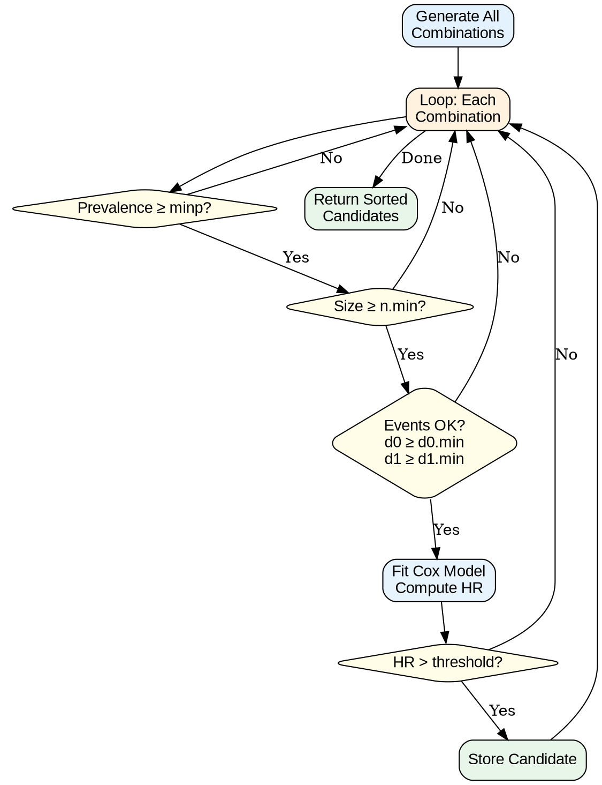

---

## Diagram 7: Fixed Consistency Algorithm

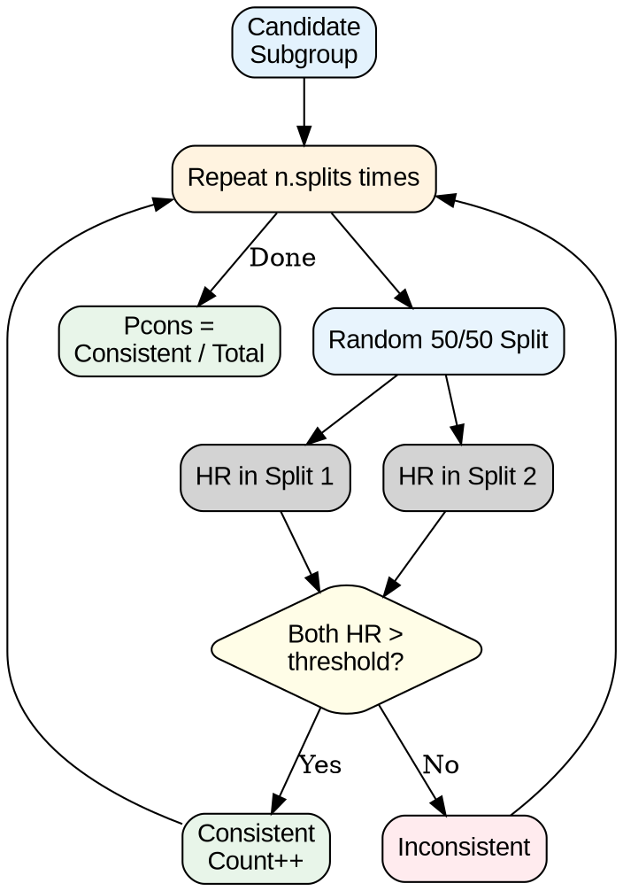

---

## Diagram 8: Two-Stage Consistency Algorithm

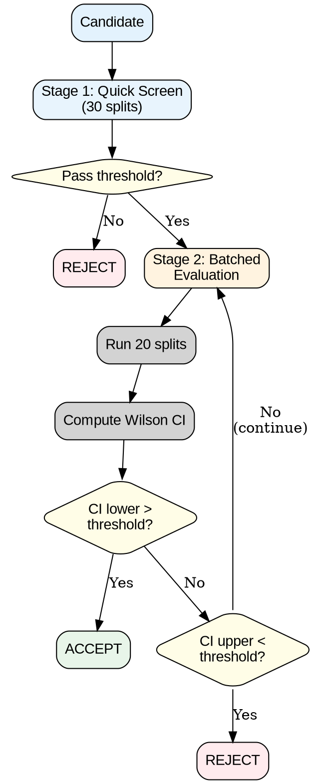

---

## Diagram 9: Bootstrap Bias Correction

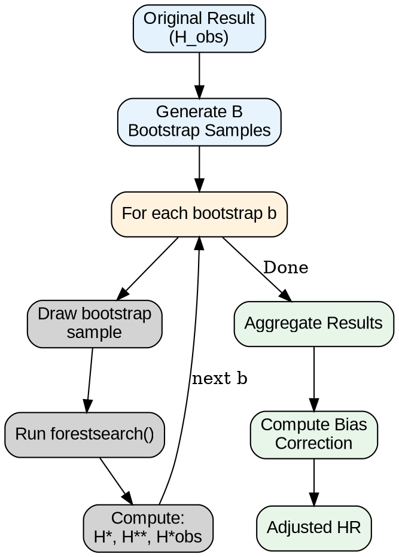

---

## Diagram 10: K-Fold Cross-Validation

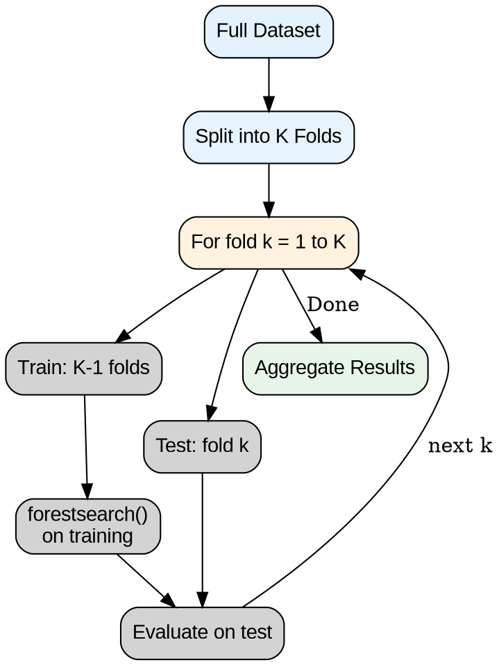

---

## Diagram 11: Package Dependencies

```dot
digraph Dependencies {
  rankdir=TB;
  node [shape=box, style="rounded,filled", fontname="Arial"];
  
  fs [label="forestsearch", fillcolor="#2E86AB", fontcolor="white"];
  
  // Statistical
  subgraph cluster_stat {
    label="Core Statistical";
    style=filled;
    fillcolor="#E8F4FD";
    survival [label="survival"];
    grf [label="grf"];
    glmnet [label="glmnet"];
    policytree [label="policytree"];
  }
  
  // Data
  subgraph cluster_data {
    label="Data Handling";
    style=filled;
    fillcolor="#FFF3E0";
    dt [label="data.table"];
    stringr [label="stringr"];
  }
  
  // Parallel
  subgraph cluster_par {
    label="Parallel Computing";
    style=filled;
    fillcolor="#FCE4EC";
    future [label="future"];
    doFuture [label="doFuture"];
    foreach [label="foreach"];
    callr [label="callr"];
  }
  
  // Visualization
  subgraph cluster_viz {
    label="Visualization";
    style=filled;
    fillcolor="#E8F5E9";
    ggplot2 [label="ggplot2"];
    gt [label="gt"];
    forestploter [label="forestploter"];
  }
  
  fs -> survival;
  fs -> grf;
  fs -> glmnet;
  fs -> policytree;
  fs -> dt;
  fs -> stringr;
  fs -> future;
  fs -> doFuture;
  fs -> foreach;
  fs -> callr;
  fs -> ggplot2;
  fs -> gt;
  fs -> forestploter;
}
```

---

## How to Render in R

```r
library(DiagrammeR)

# Example: Render the high-level pipeline
grViz('
digraph ForestSearchPipeline {
  rankdir=LR;
  node [shape=box, style="rounded,filled", fontname="Arial"];
  
  input [label="Input\\nData", fillcolor="#E3F2FD"];
  varsel [label="Variable\\nSelection", fillcolor="#E8F4FD"];
  dataprep [label="Data\\nPreparation", fillcolor="#FFF3E0"];
  search [label="Subgroup\\nSearch", fillcolor="#FCE4EC"];
  consist [label="Consistency\\nEvaluation", fillcolor="#E8F5E9"];
  output [label="Output", fillcolor="#F3E5F5"];
  
  input -> varsel -> dataprep -> search -> consist -> output;
}
')

# Save to file
diagram <- grViz('...')
export_svg(diagram) %>% charToRaw() %>% rsvg::rsvg_png("diagram.png")
```

---

## Online Rendering

Copy any DOT code block (without the ```dot markers) to:
- https://dreampuf.github.io/GraphvizOnline/
- https://edotor.net/
- https://viz-js.com/
